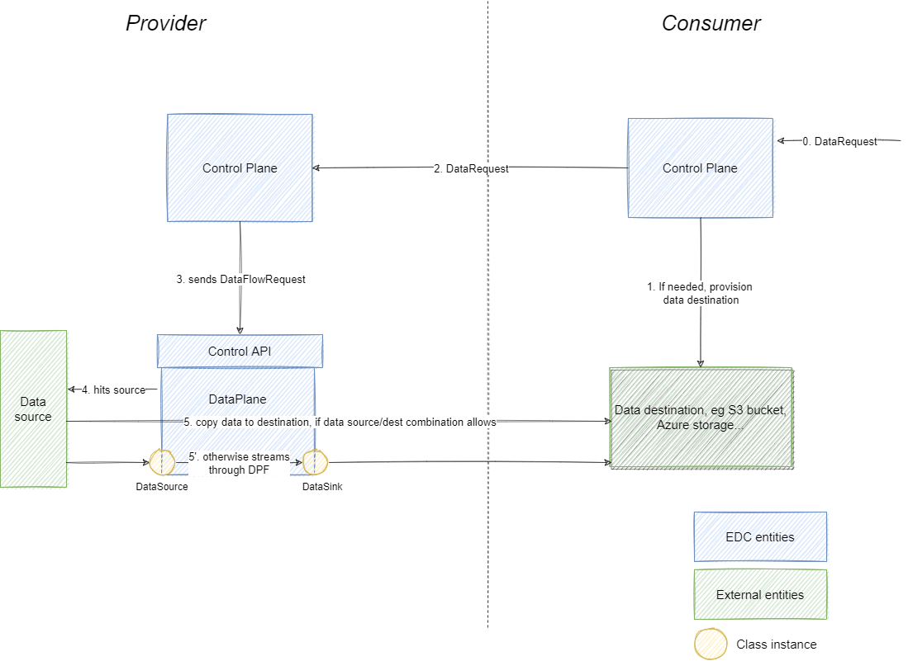

# Data Plane Transfer Client

This extension provides a client for delegating data transfer to a Data Plane instance.

## Background

After successful negotiation and contract agreement between a consumer and a provider, the Data Plane must be triggered to perform the actual data transfer.

### Scope

Data transfer from source to destination

### Use Cases

This extension is dedicated to use-cases wherein the consumer wants specific data from a given provider to be pushed in a recipient storage in its own environment.

## Technical Details

### Interfaces

### Dependencies

| Name                                        | Description                             |
|:--------------------------------------------|:----------------------------------------|
| extensions:data-plane:data-plane-spi        | Required for `DataPlaneManager`         |
| extensions:data-plane-selector:selector-spi | Required for `DataPlaneSelectorService` |

### Configurations

| Parameter name                                      | Description                                                                                                                        | Mandatory | Default value                          |
|:----------------------------------------------------|:-----------------------------------------------------------------------------------------------------------------------------------|:----------|:---------------------------------------|
| `edc.transfer.client.selector.strategy`             | Selection strategy used by the client to determine to which Data Plane instance data transfer should be delegated                  | false     | random                                 |

## Terminology

## Design Principles

This extension provides a client for delegating a data transfer to the data plane. As Data Plane exposes both a Java and a REST API, the client
is designed to support both. The extension is centered around the `DataPlaneTransferFlowController` which is triggered for any data request
whose destination type is different from `HttpProxy` (this one being reserved for Client Pull data transfers). This controller maps the incoming
`DataRequest` into a `DataFlowRequest`, which is mainly composed of source/destination data address pair. This `DataFlowRequest` is
finally forwarded to the Data Plane by the client.

#### Flow diagram

## Decisions

