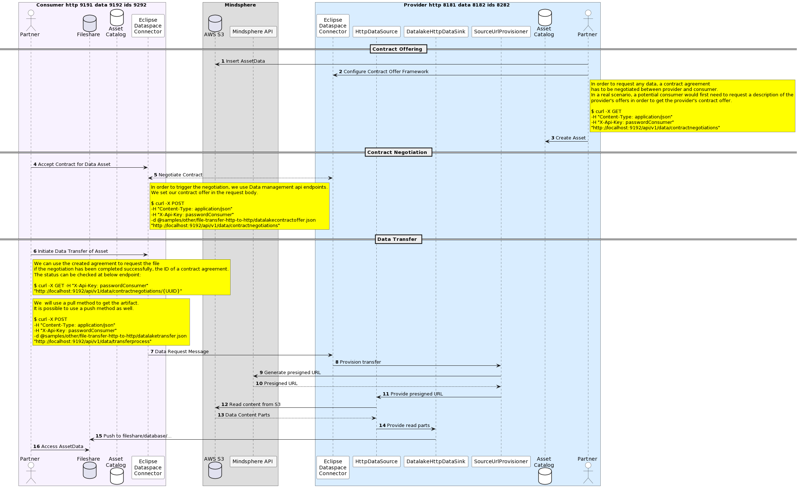

# Perform a artifact download

This is similar to [04.0-file-transfer](../../../04.0-file-transfer/README.md) - the tasks are the same:

* [Same] Creating an additional connector, so that in the end we have two connectors, a consumer and a provider
* [Same] Providing communication between provider and consumer using IDS multipart messages
* [Same] Utilize Data management API to interact with connector system.
* [Same] Performing a contract negotiation between provider and consumer
* [Same] Performing a file transfer
  * [Same] The consumer will initiate a file transfer
  * [Different] The provider will fulfill that request by creating on the fly a presigned url for the cloud file and copy that file to the desired location. The presigned url expires so creating it in at the beginning could potentially lead to a bug due to unavailable resource.
  
## Transfer implementations

There are currently multiple implementation for the transfer available:
* Old implementation 
    - uses [org.eclipse.dataspaceconnector.api.control.ClientController](../../../../extensions/api/control/src/main/java/org/eclipse/dataspaceconnector/api/control/ClientController.java) for data transfer
    - endpoint /control/transfer
    - no JTA support
    - deprecated since 04/13/2022
* Custom implementation 
    - uses [com.siemens.mindsphere.datalake.edc.http.ConsumerApiController.initiateDataRequest](api/src/main/java/com/siemens/mindsphere/datalake/edc/http/ConsumerApiController.java)
    - endpoint /transfer/data/request
    - not standard
    - no multipart support
* Current implementation 
    - uses [org.eclipse.dataspaceconnector.api.datamanagement.transferprocess.TransferProcessApiController.initiateTransfer](../../../../extensions/api/data-management/transferprocess/src/main/java/org/eclipse/dataspaceconnector/api/datamanagement/transferprocess/TransferProcessApiController.java)
    - endpoint /transferprocess
    - main difference from the deprecated control point is that the call to manager.initiateConsumerRequest is wrapped in a transaction context provided by [org.eclipse.dataspaceconnector.spi.transaction.TransactionContext](../../../../extensions/transaction/transaction-spi/src/main/java/org/eclipse/dataspaceconnector/spi/transaction/TransactionContext.java) thefore allowing JTA
    
Transfer process is done by a state machine:


Provisioning means:
* On a consumer, provisioning may entail setting up a data destination and supporting infrastructure
* On a provider, provisioning is initiated when a request is received and map involve preprocessing data or other operations
* The code [org.eclipse.dataspaceconnector.transfer.core.transfer.TransferProcessManagerImpl.processProvisioning](../../../../core/transfer/src/main/java/org/eclipse/dataspaceconnector/transfer/core/transfer/TransferProcessManagerImpl.java) is used for e.g. to provision the resource before transfer
* Examples for provioners supporting 
    - org.eclipse.dataspaceconnector.aws.s3.provision.AwsProvisionExtension
        - [org.eclipse.dataspaceconnector.aws.s3.provision.S3BucketProvisioner](../../../../extensions/aws/s3/s3-provision/src/main/java/org/eclipse/dataspaceconnector/aws/s3/provision/S3BucketProvisioner.java)
    - org.eclipse.dataspaceconnector.provision.azure.AzureProvisionExtension
        - [org.eclipse.dataspaceconnector.provision.azure.blob.ObjectStorageProvisioner](../../../../extensions/azure/blobstorage/blob-provision/src/main/java/org/eclipse/dataspaceconnector/provision/azure/blob/ObjectStorageProvisioner.java)
    - org.eclipse.dataspaceconnector.transfer.provision.http.HttpProvisionerExtension
        - [org.eclipse.dataspaceconnector.transfer.provision.http.impl.HttpProviderProvisioner](../../../../extensions/http-provisioner/src/main/java/org/eclipse/dataspaceconnector/transfer/provision/http/impl/HttpProviderProvisioner.java)
    - com.siemens.mindsphere.datalake.edc.http.DataLakeExtension
        - [com.siemens.mindsphere.datalake.edc.http.provision.DestinationUrlProvisioner](../../../../extensions/mindsphere/mindsphere-http/src/main/java/com/siemens/mindsphere/datalake/edc/http/provision/DestinationUrlProvisioner.java)

Process PROVISIONED transfer
* If CONSUMER, set it to REQUESTING, if PROVIDER initiate data transfer

Process REQUESTING transfer
* If CONSUMER, send request to the provider, should never be PROVIDER

Process REQUESTED transfer
* If is managed or there are provisioned resources set IN_PROGRESS or STREAMING, do nothing otherwise

Process IN PROGRESS transfer 
* if is completed or there's no checker and it's not managed, set to COMPLETE, nothing otherwise

Process DEPROVISIONING transfer
* Launch deprovision process. On completion, set to DEPROVISIONED if succeeded, ERROR otherwise
* This can be used to invalidate created presigned URLs on both consumer and provider for security reasons

    
## Sample call

Note that [samples/other/file-transfer-http-to-http/provider/src/main/java/com/siemens/mindsphere/SourceUrlExtension.java](../provider/src/main/java/com/siemens/mindsphere/SourceUrlExtension.java) contains:
* Sample policy
* Sample asset 
    * datalakepath equal to data/ten=castidev/data.csv
    * type HttpData so that it is handled by [extensions/data-plane/data-plane-http/src/main/java/org/eclipse/dataspaceconnector/dataplane/http/pipeline/HttpDataSourceFactory.java](../../../../extensions/data-plane/data-plane-http/src/main/java/org/eclipse/dataspaceconnector/dataplane/http/pipeline/HttpDataSourceFactory.java)
* Sample contract definition 
    * id 9
    * selector on the asset above called data.csv

The [extensions/mindsphere/mindsphere-http/src/main/java/com/siemens/mindsphere/datalake/edc/http/dataplane/DatalakeHttpDataSinkFactory.java](../../../../extensions/mindsphere/mindsphere-http/src/main/java/com/siemens/mindsphere/datalake/edc/http/dataplane/DatalakeHttpDataSinkFactory.java) datalake specific dataplane sink is used to flush the data to Mindsphere integration datalake.
It is selected by type "mindsphere", which gets set inside the [com.siemens.mindsphere.datalake.edc.http.provision.SourceUrlProvisioner.provision](../../../../extensions/mindsphere/mindsphere-http/src/main/java/com/siemens/mindsphere/datalake/edc/http/provision/SourceUrlProvisioner.java) method.

The call flow is the following:
* call consumer to negociate a contract
    * ```curl -X POST -H "Content-Type: application/json" -H "X-Api-Key: passwordConsumer" -d @samples/other/file-transfer-http-to-http/datalakecontractoffer.json "http://localhost:9192/api/v1/data/contractnegotiations"```
* call consumer to find the newly negociated contract agreement id (e.g. [{"contractAgreementId":"9:1bd6da05-bb4c-43e8-ba37-dd8854b95c6b","counterPartyAddress":"http://localhost:8282/api/v1/ids/data","errorDetail":null)
    * ```curl -X GET -H "Content-Type: application/json" -H "X-Api-Key: passwordConsumer"  "http://localhost:9192/api/v1/data/contractnegotiations"```
* modify [samples/other/file-transfer-http-to-http/datalaketransfer.json](../datalaketransfer.json) by replacing existing contractId with the newly created one
* call consumer to trigger transfer process
    * ```curl -X POST -H "Content-Type: application/json" -H "X-Api-Key: passwordConsumer" -d @samples/other/file-transfer-http-to-http/datalaketransfer.json "http://localhost:9192/api/v1/data/transferprocess"```
    
---
**NOTE**
We tested using a destination on the same mindsphere tenant with another name. We generated the destination url using the below code (put inside [extensions/mindsphere/mindsphere-http/src/main/java/com/siemens/mindsphere/datalake/edc/http/DataLakeClientImpl.java](../../../../extensions/mindsphere/mindsphere-http/src/main/java/com/siemens/mindsphere/datalake/edc/http/DataLakeClientImpl.java)):
```java
    public static void main(String[] args) throws MalformedURLException, DataLakeException {
        final String tokenmanagementClientId = "REPLACE ME";
        final String tokenmanagementClientSecret = "REPLACE ME";
        final String tokenmanagementClientAppName = "REPLACE ME";
        final String tokenmanagementClientAppVersion = "v1.0.0";
        final String tokenmanagementAddress = "https://gateway.eu1.mindsphere.io/api/technicaltokenmanager/v3/oauth/token";
        final String datalakePath = "data/ten=castidev/data_dataplane1.csv";
        final String dataLakeAddress = "https://gateway.eu1.mindsphere.io/api/datalake/v3";

        final String applicationTenant = "castiop";

        final URL url = new URL(dataLakeAddress);

        final OauthClientDetails oauthClientDetails = new OauthClientDetails(tokenmanagementClientId, tokenmanagementClientSecret,
                tokenmanagementClientAppName, tokenmanagementClientAppVersion, applicationTenant, new URL(tokenmanagementAddress));
        final DataLakeClientImpl clientImpl = new DataLakeClientImpl(oauthClientDetails, url);
        final URL createdUrl = clientImpl.getPresignedUploadUrl(datalakePath);

        System.out.println("Created presigned url: " + createdUrl.toString());
    }
```
---...
    
 

## Relevant documentation


## Open API documentation

Open API doc is available at [openapi.md](../../../../openapi.md) and [resources/openapi/openapi.yaml](../../../../resources/openapi/openapi.yaml).
        
    